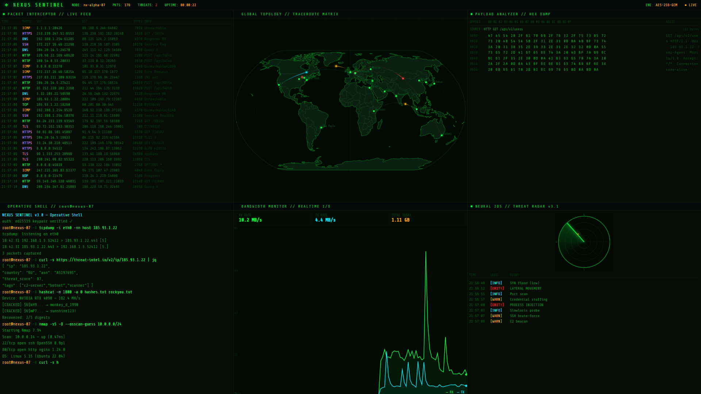

# ◈ NEXUS SENTINEL

> *"What if your screen looked like you actually knew what you were doing?"*

A fully animated, single-file **cybersecurity operations dashboard** — designed to look like a real-time threat monitoring console straight out of a hacker movie. No backend, no dependencies to install, no build step. Just open `index.html`.



---

## Live Demo

**[→ Open in browser](https://yourusername.github.io/nexus-sentinel/)**

---

## What's inside

Six live panels, all animated, all running in your browser:

| Panel | Description |
|---|---|
| **Packet Interceptor** | Simulated live network traffic stream — TCP, UDP, TLS, ICMP, DNS, SSH with realistic IPs, ports, and payload descriptions |
| **Global Topology** | Real-world map (Natural Earth 110m geodata via D3.js + TopoJSON) with animated traceroute hops chaining city-to-city across 17 global nodes |
| **Payload Analyzer** | Hex dump viewer cycling through realistic packet payloads — TLS ClientHello, HTTP GET, SSH handshake, DNS query, x86-64 shellcode stub, C2 beacon |
| **Operative Shell** | Auto-typing terminal running `nmap`, `hashcat`, `volatility3`, `tcpdump`, `ssh`, `traceroute` and more with color-coded output |
| **Bandwidth Monitor** | Real-time RX/TX chart with spike simulation, adaptive Y-scale, and cumulative transfer counter |
| **Neural IDS / Threat Radar** | Rotating radar sweep with color-coded blips (info/warning/critical) and live threat event log |

---

## Usage

```bash
# Clone the repo
git clone https://github.com/yourusername/nexus-sentinel.git
cd nexus-sentinel

# Open directly in your browser — no server needed
open index.html        # macOS
start index.html       # Windows
xdg-open index.html   # Linux
```

Or just download `index.html` and double-click it.

**For the world map to load**, the browser needs internet access to fetch Natural Earth geodata (~100KB) from `cdn.jsdelivr.net`. If offline, it gracefully falls back to a simplified outline.

---

## Technical notes

- **Zero dependencies to install** — D3.js v7 and TopoJSON v3 are loaded from CDN at runtime
- **Single HTML file** — everything (HTML, CSS, JS) is self-contained
- **Pure Canvas 2D** — all animations run on `requestAnimationFrame` loops
- **Responsive** — panels adapt to window size on resize
- **No data leaves your machine** — all content is procedurally generated; the only external request is the geodata fetch

### External resources loaded at runtime

| Resource | Purpose | Source |
|---|---|---|
| `world-atlas@2/countries-110m.json` | Country borders & land mass | cdn.jsdelivr.net |
| `d3 v7.8.5` | Geographic projection & path rendering | cdnjs.cloudflare.com |
| `topojson v3.0.2` | TopoJSON format parsing | cdnjs.cloudflare.com |
| `Share Tech Mono` | Monospace terminal font | fonts.googleapis.com |

---

## The making of

This project was **conceived and directed by [Danilo](https://linkedin.com/in/yourprofile)** as part of an exploration into AI-assisted development and prompt engineering.

The entire codebase was written by **[Claude](https://claude.ai)** (Anthropic's AI) through an iterative conversation — from initial concept to six-panel layout, real geodata integration, hex dump simulation, and hop-chaining traceroute logic.

**No code was written by hand.** Every feature, fix, and refinement was driven by natural language prompts.

> Danilo's role: product vision, UX direction, iterative feedback, and prompt craft.  
> Claude's role: architecture, implementation, debugging, and documentation.

This is what **"Prompt Master"** looks like in practice — knowing what to build, how to describe it, and how to push an AI system toward a result that actually looks good.

---

## Customization

Want to tweak it? Everything is in `index.html`. Key areas:

- **City nodes**: edit the `CITIES` array to add/remove locations
- **Terminal commands**: add entries to the `CMDS` array
- **Threat events**: edit the `THREATS` array in the radar section
- **Packet payloads**: add new generators to the `PAYLOADS` array
- **Colors**: CSS variables at the top of `<style>` — `--grn`, `--cyn`, `--amb`, `--red`, `--mgn`
- **Arc speed**: `sp` range in `newArc()` — lower = slower hops

---

## License

MIT — do whatever you want with it.  
If you build something cool on top of it, I'd love to hear about it.

---

## Acknowledgements

- [D3.js](https://d3js.org/) — Mike Bostock's indispensable data visualization library
- [Natural Earth](https://www.naturalearthdata.com/) — free, public domain map data
- [world-atlas](https://github.com/topojson/world-atlas) — pre-built TopoJSON for Natural Earth
- [Share Tech Mono](https://fonts.google.com/specimen/Share+Tech+Mono) — the font that makes everything look hacker-ish
